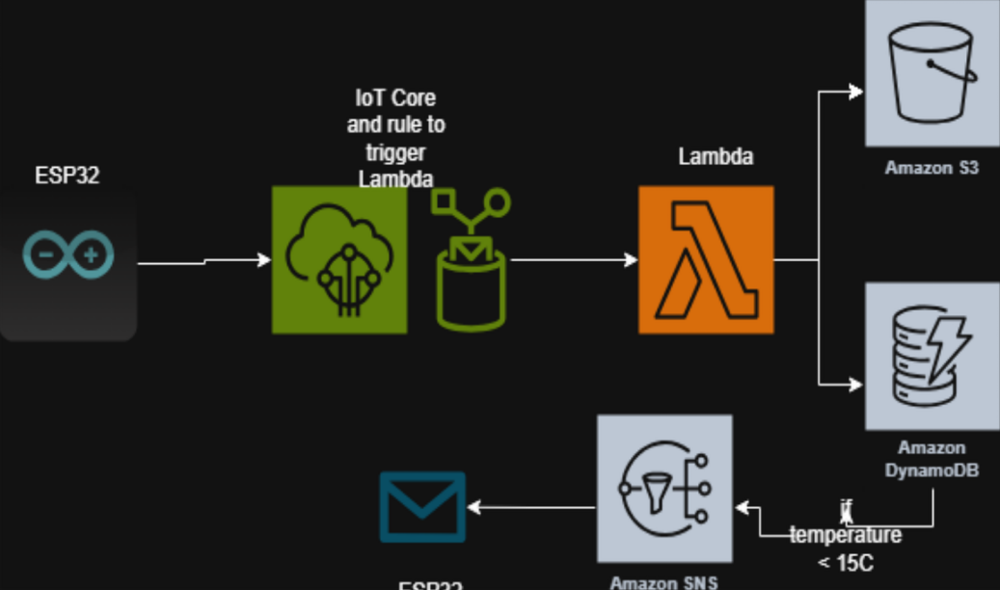
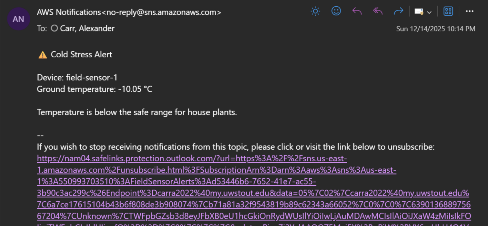

# AWS IoT Cold Stress Monitor

A class project using an ESP32 with IR temperature sensors connected to AWS IoT Core to monitor ground and air temperatures. When ground temperature drops below 15°C, the system automatically sends an email alert warning that conditions are unsafe for house plants.

---

## Architecture



The ESP32 publishes temperature readings as JSON to AWS IoT Core every ~15 seconds. An IoT rule triggers a Lambda function on each message, which stores the data in DynamoDB and S3. A separate DynamoDB stream triggers SNS to send an email alert when ground temperature falls below the threshold.

| Service | Role |
|---|---|
| ESP32 | Reads IR sensors and publishes data to AWS IoT Core via MQTT |
| AWS IoT Core | Receives MQTT messages and triggers rules |
| AWS Lambda | Processes incoming data, writes to DynamoDB and S3 |
| Amazon DynamoDB | Stores all temperature readings |
| Amazon S3 | Archives raw sensor data |
| Amazon SNS | Sends cold stress alert emails when threshold is breached |

---

## Payload Format

Data is published to AWS IoT Core as JSON:

```json
{
  "deviceId": "field-sensor-1",
  "groundSurfaceTempC": 21.71,
  "airTempC": 22.83,
  "location": "test-field"
}
```

---

## Alert

When ground temperature drops below **15°C**, SNS sends an email alert:



---

## Hardware

| Component | Purpose |
|---|---|
| ESP32 Development Board | Microcontroller / MQTT client |
| MLX90614 IR Temp Sensor ×2 | Ground surface and air temperature |

---

## Future Plans

- Add more sensors for more varied data coverage
- Implement AWS QuickSight for data visualization and dashboards

---

## Notes

This was built as a final project for a cloud computing course. The Lambda function code is not included as the AWS account is no longer accessible. The alert threshold (15°C) was hardcoded in the Lambda function.
